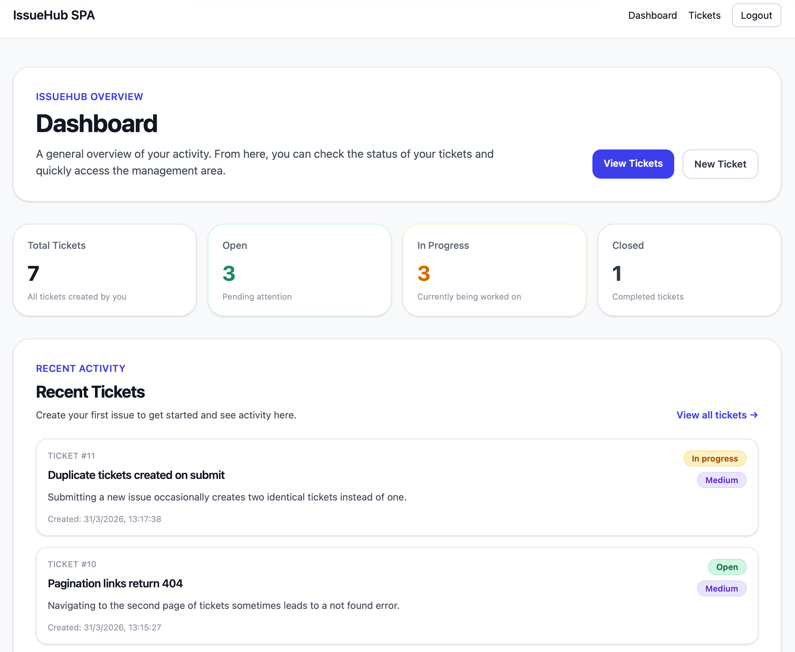
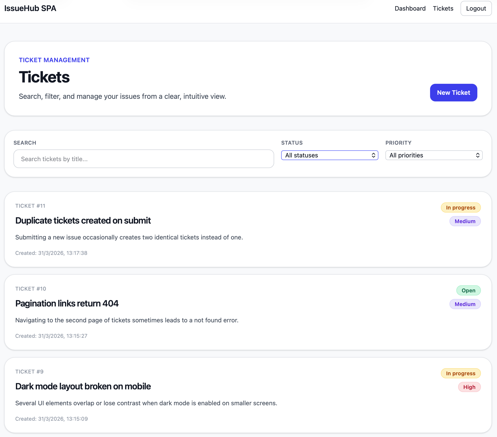
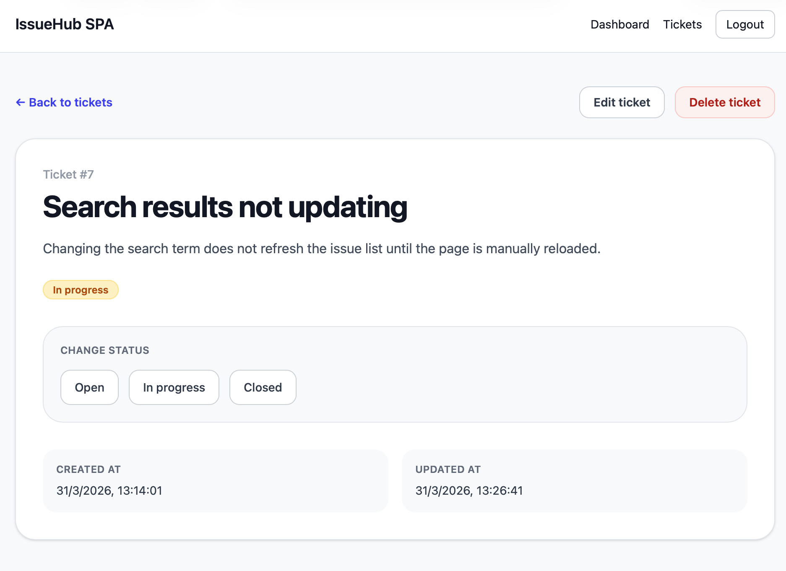
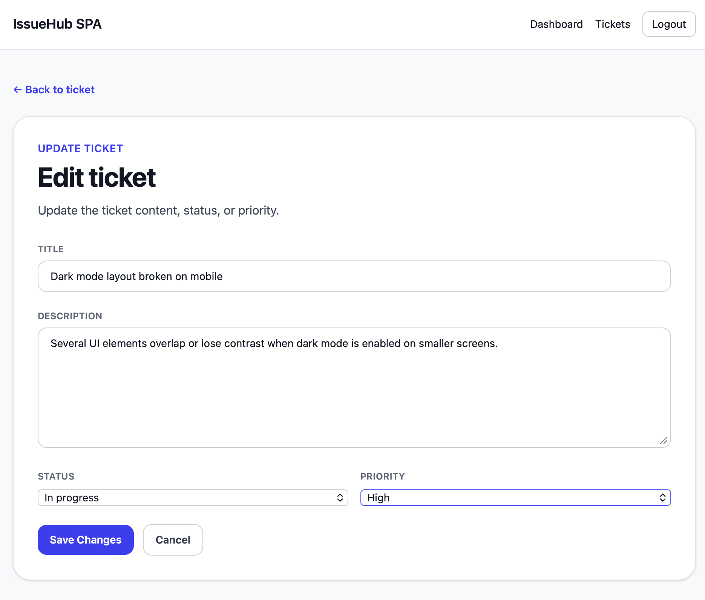

# IssueHub — Fullstack Ticket Management System

IssueHub is a fullstack ticket management application built to demonstrate a clean separation between backend and frontend architecture.

It combines a Laravel REST API with a React SPA, featuring authentication, dashboard metrics, ticket management workflows, filtering, search, and full CRUD operations.

---

## Overview

This project was built as a portfolio-ready case study to showcase modern fullstack development with:

* Laravel 13 as the backend API
* React + TypeScript as the frontend SPA
* Token-based authentication using Laravel Sanctum
* Server-state management with TanStack Query
* Tailwind CSS for UI styling

IssueHub focuses on workflows commonly found in internal tools, admin systems, and SaaS platforms.

---

## Project Structure

This project is organized as a monorepo:

```
issuehub/
  README.md
  screenshots/
  issuehub-api/
  issuehub-spa/
```

* `/issuehub-api` → Laravel backend API
* `/issuehub-spa` → React frontend SPA

---

## Features

### Authentication

* Login with API token authentication
* Protected SPA routes
* Logout flow

### Dashboard

* Total tickets count
* Tickets by status:

    * Open
    * In Progress
    * Closed
* Recent tickets overview

### Ticket Management

* Create new tickets
* View ticket details
* Edit full ticket information
* Quick status updates
* Delete tickets

### Filtering & Navigation

* Search tickets by title
* Filter by status
* Filter by priority
* Paginated ticket listing
* URL-driven filter state

---

## Tech Stack

### Backend

* Laravel 13
* Laravel Sanctum
* Eloquent ORM
* API Resources
* Authorization Policies

### Frontend

* React 19
* TypeScript
* Vite
* React Router
* TanStack Query
* Axios
* Tailwind CSS

### Architecture

* RESTful API
* Token-based authentication
* Server-state management
* Monorepo structure

---

## Screenshots

(Add your screenshots here)

### Dashboard



### Tickets List



### Ticket Detail



### Edit Ticket



---

## API Endpoints

### Auth

* POST /api/login
* GET /api/me

### Tickets

* GET /api/tickets
* POST /api/tickets
* GET /api/tickets/{id}
* PATCH /api/tickets/{id}
* DELETE /api/tickets/{id}

### Dashboard

* GET /api/dashboard/stats

---

## Installation

### Clone repository

```bash
git clone https://github.com/AlbertoKaz/issuehub.git
cd issuehub
```

---

### Backend (Laravel API)

```bash
cd issuehub-api
composer install
cp .env.example .env
php artisan key:generate
php artisan migrate
php artisan serve
```

---

### Frontend (React SPA)

```bash
cd ../issuehub-spa
npm install
npm run dev
```

---

## Environment Variables

### Frontend

```env
VITE_API_URL=http://127.0.0.1:8000/api
```

---

## Future Improvements

* Toast notifications instead of alerts
* Real-time updates (WebSockets)
* Role-based access control
* Ticket comments system
* Better loading skeletons
* Dedicated recent tickets endpoint

---

## Why this project

This project demonstrates the ability to build a complete fullstack application with:

* Backend API design
* Frontend SPA architecture
* Authentication workflows
* CRUD operations
* State synchronization

It reflects real-world SaaS and internal tool development patterns.

---

## License

For portfolio and educational purposes.
